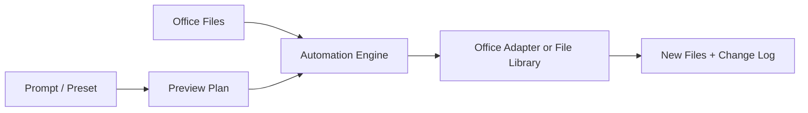

<!-- Hero Banner -->

  

  <h1>
    
  </h1>

  <em><strong>अतुल्य</strong> (Atulya) — Peerless &nbsp;·&nbsp; <strong>Office</strong> — Desktop productivity elevated</em> 
  <strong>One-click local automations for spreadsheets, documents, email, and presentations: clean sheets, merge documents, sort attachments, and prompt-to-formula AI.</strong>

  
  
  
  
  

---

Atulya-Office is planned as a free toolbox for repetitive office work: clean sheets, generate letters, build presentations, organize mail attachments and turn plain-English requirements into formulas or approved automation steps.

> 🚧 This repository is currently the product roadmap. Macros, add-ins and installers will be published as they are implemented and tested.

## 💬 Example Requests

| User request | Planned result |
|---|---|
| "Merge all branch reports and remove duplicate invoices" | Clean consolidated Excel workbook |
| "Give me a formula for overdue invoices above 30 days" | Excel formula with explanation and sample |
| "Create offer letters from this employee sheet" | Word documents and PDFs |
| "Make monthly sales slides from this workbook" | PowerPoint presentation |
| "Save invoice attachments by vendor" | Reviewed Outlook automation rule |

## 🧰 Automation Packs

| Pack | Tools |
|---|---|
| Excel | Merge, split, compare, formulas, dashboards, reconciliation |
| Word | Template fill, letters, contracts, certificates and PDF output |
| Outlook | Attachment organizer, mail merge, reminders and action extraction |
| PowerPoint | Monthly decks, chart refresh and template-based slide creation |
| Formula AI | Prompt-to-formula, formula repair and plain-English explanation |

## 🖱️ Planned Setup

- Desktop installer for Windows, macOS and Linux for file-first tools.
- Office add-in path for supported Excel/Word/PowerPoint environments.
- Signed VBA templates for workflows that specifically require desktop Office.
- Sample workbooks and a safe preview before modifying source files.

## 🏗️ Architecture

```mermaid
flowchart LR
    PROMPT["Prompt / Preset"] --> PLAN["Preview Plan"]
    FILES["Office Files"] --> ENGINE["Automation Engine"]
    PLAN --> ENGINE
    ENGINE --> ADAPTER["Office Adapter or File Library"]
    ADAPTER --> OUTPUT["New Files + Change Log"]
```

## 🗺️ Roadmap

| Phase | Delivery |
|---|---|
| 1 | Excel cleaner/merger, formula assistant and template gallery |
| 2 | Word mail merge and document generation |
| 3 | PowerPoint report generation from Excel |
| 4 | Outlook attachments and approved email workflows |
| 5 | Cross-platform add-in, installer and template gallery |

## 🔐 Trust Rules

Original files should be preserved by default. Email sending, macros and external AI calls must be visible and user-approved. Sensitive document content should support fully local processing.

## 📜 License

MIT planned for Atulya-authored automation templates and source.
