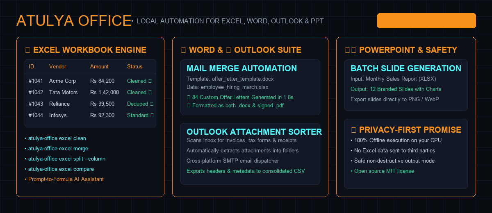

<!-- Hero Banner -->
<div align="center">
  
</div>

<div align="center">
  <h1>
    
  </h1>
</div>

<p align="center">
  <em><strong>अतुल्य</strong> (Atulya) — Peerless &nbsp;·&nbsp; <strong>Office</strong> — Productivity elevated</em><br/>
  <strong>Cross-platform CLI and automation toolkit for Excel, Word, Outlook, and PowerPoint: merge spreadsheets, generate documents, sort mail, and automate repetitive office tasks 100% locally.</strong>
</p>

<p align="center">
  <a href="LICENSE"></a>
  <a href="https://python.org"></a>
  <a href="#"></a>
  <a href="#"></a>
  <a href="#"></a>
  
</p>

```
 ┌─────────────────────────────────────────────────────────────────────────────┐
 │                         ATULYA OFFICE WORKFLOW                              │
 ├─────────────────────────────────────────────────────────────────────────────┤
 │   📂 Raw Files (XLSX, DOCX, PPTX) ──► atulya-office CLI / Python Engine    │
 │                                            │                                │
 │         ┌──────────────────────────────────┼────────────────────────────────┐
 │         ▼                                  ▼                                ▼
 │   📊 Excel Engine                    📝 Word Mail Merge              📬 Outlook Sync
 │   Clean · Merge · Split · Diff       Fill Templates · Docx-to-Text   Search · Export · Mail
 │         │                                  │                                │
 │         └──────────────────────────────────┼────────────────────────────────┘
 │                                            ▼                                
 │                       📊 PowerPoint Decks (Batch Gen)                       │
 └─────────────────────────────────────────────────────────────────────────────┘
```

---

## ⚡ Quick Start

### Installation

```bash
# Clone the repository
git clone https://github.com/atulyaai/Atulya-Office.git
cd Atulya-Office

# Install in development mode
pip install -e .
```

Verify installation:
```bash
atulya-office --help
```

---

## 🧰 Command Reference

### 📊 Excel Automation (`atulya-office excel`)

| Command | Usage | Description |
|---|---|---|
| `clean` | `atulya-office excel clean data.xlsx -o cleaned.xlsx` | Deduplicates rows, prunes blanks, and standardizes dates |
| `merge` | `atulya-office excel merge q1.xlsx q2.xlsx -o full_year.xlsx` | Merges multiple workbooks into a single sheet or workbook |
| `split` | `atulya-office excel split roster.xlsx --column "Department"` | Splits sheet into separate workbooks by column value |
| `compare` | `atulya-office excel compare old.xlsx new.xlsx` | Diffs two sheets and outputs discrepancies |
| `search` | `atulya-office excel search report.xlsx --value "Invoice #123"` | Scans across all sheets for exact or fuzzy matches |

### 📝 Word Automation (`atulya-office word`)

| Command | Usage | Description |
|---|---|---|
| `merge` | `atulya-office word merge template.docx --data employees.xlsx -o ./output/` | Mail-merges spreadsheet rows into individual DOCX documents |
| `convert` | `atulya-office word convert document.docx -o document.txt` | Extracts plain-text from formatted Word documents |

### 📬 Outlook & Email Automation (`atulya-office outlook`)

| Command | Usage | Description |
|---|---|---|
| `search` | `atulya-office outlook search --subject "Invoice" --since 2026-01-01` | Searches mail folders by subject, sender, or date range |
| `export` | `atulya-office outlook export -o emails.xlsx --folder "Inbox"` | Exports email headers and messages to Excel/CSV |
| `send` | `atulya-office outlook send --to client@example.com --subject "Report"` | Sends automated emails via cross-platform SMTP |

### 📽️ PowerPoint Automation (`atulya-office ppt`)

| Command | Usage | Description |
|---|---|---|
| `batch` | `atulya-office ppt batch template.pptx --data sales.xlsx -o ./decks/` | Generates branded presentations populated with tabular data |
| `export` | `atulya-office ppt export deck.pptx -o ./slides/ --format png` | Exports presentation slides directly into PNG images |

---

## 🔒 Security & Privacy

- **100% On-Device Processing**: File operations, merges, and text extractions run strictly on your local CPU.
- **Zero Cloud Uploads**: Your financial sheets, contracts, and emails never leave your machine.
- **Safe Previews**: Source files are preserved; modified files are created alongside or in designated output folders.

---

## 📜 License

MIT License. Copyright (c) 2026 Atulya AI.
